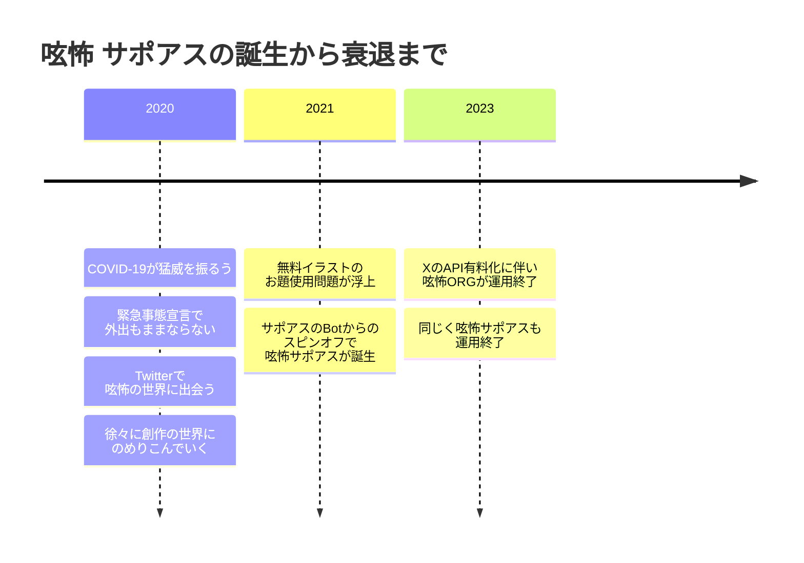

# 呟怖サポアス

- ＃呟怖 をより安全に楽しむために、お題の類似画像チェックを行い、なければ「いいね」するBot。
- 呟怖(つぶこわ)とは、Twitterでハッシュタグ #呟怖 をつけてツイートすれば、誰でも参加・投稿できる140文字以内の創作・実話の怖い話。
- 自分でお題を考えて書くもよし、#このお題で呟怖をください にリツイートするかたちで書くもよし。
- #このお題で呟怖をください にはお題と関連のある写真やイラストが貼付されていることがある。

## タイムライン

## きっかけ

- #このお題で呟怖をください の投稿者とイラスト作者間でトラブルが発生する。
- お題の画像には「フリー素材」が使用されていたが、イラスト作者が呟怖の挿絵として使われていることに対して「ホラー作品の挿絵としての使用は目的から外れている」との抗議があり、お題をはじめ、リツイートの作品まで削除することとなった。
- 掲載作品の転載・2次利用については [呟怖.ORG](https://www.tsubukowa.org/rule/) で明記されているものの、著作権を侵害している可能性のある画像を使用しているお題も（わりと）多く、知らず知らずのうちに著作権侵害に加担する危険性があった。
- この騒動で一時的に呟怖が冷え込んだ。このまま衰退するのはやだなぁと、ITで解決できないか考えた。

## Botの役割

- サポアスのBotをベースに改良を加えた。
- #このお題で呟怖をください に貼付されている画像のツイートを定期的にクローリングし、あればBingの画像検索を使い類似画像を検索する。
- 検索にヒットすればどこかからの転用物、ヒットしなければお題のために作成された画像として判断。
- お題のために作成された画像（転用されていないもの）であれば、そのお題に対してBotがいいねをつける。（注意喚起やブラックリストのようなものではなく、発信者が侵害の可能性に気づき、自ら改善するような自浄作用を期待）

## 効果

- 一部呟怖ユーザーはフォローして使ってくださった様子。
- Bingの画像検索の精度がよく、加工済みの画像でも高確率でオリジナルがヒットしていた印象がある。
- 裏側でチェックに引っかかったアカウントをリスト化する機能を装備していて、要注意アカウントのお題は踏まないようにしていた。

## 呟怖サポアス亡き後

- Twitter → Xの以降に伴い、呟怖.ORGの運用が終了し、呟怖自体が盛り下がった印象は否めない。
- 呟怖サポアス自体も無料APIが使えなくなり、運用終了に至った。
- Xが触れたくない誹謗中傷やニュースであふれ、純粋に作品を楽しむ場でなくなってしまったこともあり、最近は作品を作ることも無くなった。
- とはいえ今もなお作品を発信し続ける[メンバー](https://tsubukowa.org/members/)も多く、まだまだ愛されている呟怖。少し落ち着いたらまたやってみたいかも。合掌。

## おまけ

- [昔作った作品](https://twitter.com/gosaaan1/status/1476345587893415936)

自分も何度か #このお題で呟怖をください をやってみたことがあるのですが、呟怖作品を寄せてくれた人にひとつひとつコメントを返さないといけなくて大変だったのと、一時期「ひとり1日1呟怖マラソン」をやっていて、毎晩1時間ほどウンウン悩みながら作品を作っていた頃もありましたね。コーディングとはまた違った脳みそが動いて面白かったのですが、あれもしんどかったですね（笑）

とはいえ #呟怖 を通じて、世の中の怖いもの好きとSNSで繋がり合えたのは良かったと思います。
